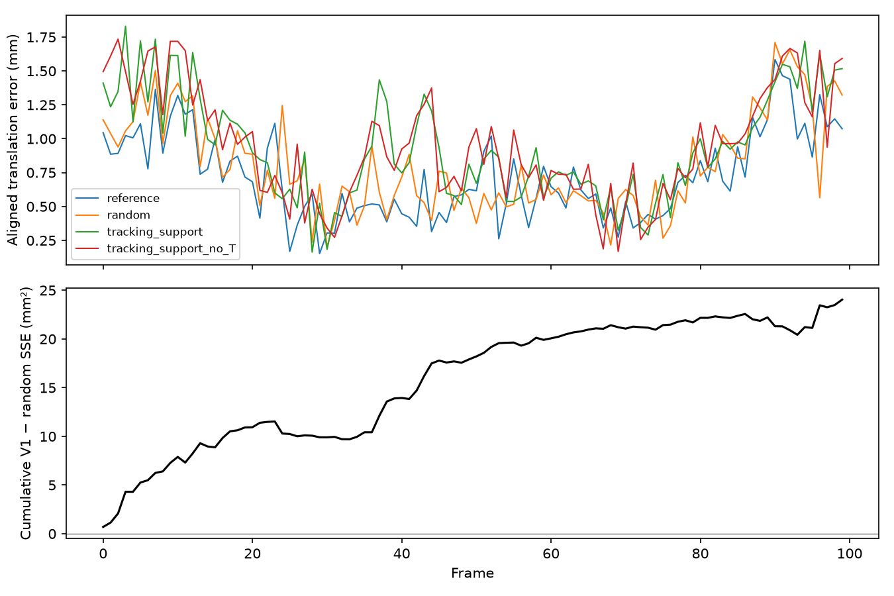

# V1 diagnosis: seed 0, office0 slice100, K=40,000

**Result:** random wins this pilot; V1 superiority is unsupported. The cause cannot be uniquely identified from these artifacts. Support floors do **not** dominate selection. Final-map concentration and policy-dependent keyframe/mapping work are supported observations; spatial or temporal over-concentration is a hypothesis. The overhead failure has a concrete implementation explanation.

Analysis date: October 1, 2026. Run revision: `c89f2af7e3967bf75eeb45986aa8025cd5570109`; inspected checkout: `18801167f260660b91a2db56d90eece46072a9d0`. The inspected controller, policy, metadata, frontend, backend and Gaussian-model files have no diff between those revisions. No V2 implementation, weight change or SLAM experiment was performed. CONFIRMED = saved results/reproduced analysis/source; INFERENCE = plausible interpretation; OPEN = unavailable evidence; PLANNED = next step.

Reproduce offline from the repository root:

```bash
MonoGS_System/MonoGS/.venv/bin/python MonoGS_System/MonoGS/scripts/analyze_retention_v1.py
LD_LIBRARY_PATH="$PWD/MonoGS_System/MonoGS/.toolchain/root/usr/lib/x86_64-linux-gnu:${LD_LIBRARY_PATH:-}" \
  MonoGS_System/MonoGS/.venv/bin/python MonoGS_System/MonoGS/scripts/profile_retention_v1_cpu.py
```

Artifacts: [machine-readable diagnosis](artifacts/retention_v1_diagnosis/diagnosis.json), [per-frame errors](artifacts/retention_v1_diagnosis/frame_errors.csv), [all admission decisions](artifacts/retention_v1_diagnosis/policy_events.csv), [CPU microbenchmarks](artifacts/retention_v1_diagnosis/cpu_microbenchmarks.json). Input hashes are recorded in the diagnosis JSON. These scripts read existing runs and write separate analysis artifacts; they do not execute SLAM.

## 1. Fairness and causal limits

**CONFIRMED:** all six manifests have the same frozen revision, empty tracked diff and seed 0. The resolved configs differ only in output directory, controller enablement, ranking policy and `use_tracking_history`. The five budgeted runs share K=40,000, L=38,000, gross densification cap 2,000, support floors, insertion/admission logic, ordinary upstream maintenance settings, camera calibration, CPU serialization and both single-thread flags. Parent/backend seed Python/NumPy/Torch; backend also seeds Open3D. All complete 100 frames; trajectories have exactly IDs 0–99, identical saved GT poses, and rendering uses the same 17 declared views. The current dataset's 201 file hashes match its slice manifest. There is no per-run dataset hash capture proving files were never changed historically.

No hidden config difference in initialization, tracking objective, keyframe thresholds or pruning cadence was found. The reference preserves upstream maintenance with passive metadata and no controller. None of these observations proves application-wide GPU-memory compliance; the strict contract is staged/live backend-map row count.

**CONFIRMED causal limitations:** same seed does not produce an identical initialized map. First synchronized row counts are reference 26,559; opacity 26,523; random 26,507; LRU 26,536; V1 26,496; no-T 26,515. None of the budgeted runs deletes a row for the budget before frame 8, and all admit all attempted densification/insertion. Raw tracked poses already differ before frame 8: at frame 3 random/V1 errors are 0.701/0.895 mm before alignment. The source does not enforce deterministic CUDA execution. The cause of this initial divergence is OPEN; do not assign it to ranking.

Keyframe selection is map-dependent, and retention changes the visibility used for keyframe/window decisions. Actual schedules differ:

| Policy | Keyframes | Ordinary mapping iterations | First divergent keyframe after 8 |
| --- | ---: | ---: | --- |
| reference | 19 | 2,700 | 13, then 24 |
| opacity / random | 18 | 2,550 | 13, then 25 |
| LRU | 16 | 2,250 | 14, then 27 |
| V1 | 15 | 2,100 | 14, then 27, 39 |
| no-T | 15 | 2,100 | 14, then 26, 38 |

Consequently, V1 gets 450 fewer mapping iterations and three fewer insertion opportunities than random. Maintenance has the same iteration-based rule but occurs at different camera frames and with different windows. RNG consumption and old-view sampling also diverge. Fixed evaluation combines final refined keyframe poses with saved non-keyframe tracking poses; frame 96 is a keyframe in V1 but not random. This is a fair **end-to-end policy protocol**, but it cannot isolate the direct causal effect of ranking. Scheduling changes are potential mediators, not evidence of unequal configured treatment. Initial stochastic divergence additionally prevents assigning the entire one-run gap to the method.

The random comparator is a fixed SplitMix64 priority on stable ID XOR seed, not a fresh random redraw at each event. Across runs the same ID need not refer to the same Gaussian after lifecycle divergence.

## 2. How much did ranking actually matter?

The following counts are reconstructed from admission telemetry. Considered/protected counts sum row-events, **not unique Gaussians**. Every row is sorted, including protected rows; only unprotected choices affect budget deletion. Densification protection counts include admitted parent operations as well as the support union.

| Policy | Insert / densify planning calls | Calls deleting rows (insert / densify) | Considered row-events | Protected row-events | Budget-deleted rows | Protected / candidates at deletion events | Retained rows selected outside protection |
| --- | ---: | ---: | ---: | ---: | ---: | ---: | ---: |
| opacity | 18 / 28 | 16 / 0 | 1,431,597 | 39,723 | 69,280 | 1.14–3.88% | 96.79% |
| random | 18 / 28 | 11 / 5 | 1,433,654 | 40,040 | 66,389 | 1.12–4.58% | 96.43% |
| LRU | 16 / 26 | 12 / 1 | 1,285,955 | 33,129 | 47,532 | 1.12–3.88% | 96.97% |
| V1 | 15 / 25 | 12 / 1 | 1,222,189 | 30,121 | 48,662 | 1.12–3.61% | 97.04% |
| no-T | 15 / 25 | 12 / 1 | 1,222,801 | 30,514 | 49,078 | 1.12–3.76% | 96.99% |

**CONFIRMED:** ranking has substantial room to matter. V1 removes roughly 8–22% of existing rows at individual pressure events; support protection directly fixes only a small fraction of survivors. Calls without deletion still compute protection, ranking and planner selection, but their ranking cannot affect existing-row retention. All growth rejection is zero: opacity/random/LRU/V1/no-T admit respectively 254,326 / 255,208 / 229,975 / 214,888 / 215,005 gross rows. The ceiling is materially restrictive, first at frame 8, mostly during insertion; it is not an inactive budget.

**OPEN:** intersection of view/origin/cell protections, number protected redundantly, overlap of protection across policies, ranking overlap and identity of marginal survivors. Telemetry stores only the union count. Original row IDs/masks were not saved. Small protection fractions rule out the strong explanation that floors left essentially no ranking freedom, but do not rule out a small protected set preserving disproportionately important rows.

## 3. What T and the score actually establish

**CONFIRMED source behavior:** each enabled comparator performs an extra final-pose render after tracking, accumulates binary `n_touched>0` once per frontend frame, then applies an aggregated EMA at the next keyframe. This is tracking visibility, not localization sensitivity or tracking-loss contribution. It is not a sparse hit-ID payload: every snapshot row is included, with zeros for misses. Actual hit sparsity is OPEN. Initial frame 0 receives no frontend tracking observation. Feedback is delayed until insertion; V1/no-T apply 14 blocks ending at frame 96, random/opacity 17 ending at 94. Final residual frames are not flushed back to the backend. `last_seen` takes the latest observed frame in a block, or preserves its previous value on misses. Clone/split children inherit T and last_seen, while their actual-observation flag starts false; the score does not consult that flag.

**Critical ablation boundary:** no-T removes `0.50*T` from ranking only. It still collects/applies T and uses `T>=0.2` in the shared spatial support floor. It is not an ablation of all tracking history. The observed ATE improvement is 0.02883 mm (2.78% relative to no-T). Different starting states and keyframe IDs prevent interpreting this as an isolated or robust causal benefit. It is consistent with a small useful ranking contribution, not proof of independent information.

**OPEN, not reconstructible from saved artifacts:** nonzero-T fraction; T/W/R event quantiles and candidate ties; last_seen update frequency; empirical decay curves; correlations T–W/T–R/T–opacity; per-term score variance; independent predictive information; and full/no-T/LRU/opacity/random ranking overlap on a common decision state. Final PLY has xyz, opacity, SH, scale and rotation, but no stable IDs, origins, ages, visibility or tracking metadata. No row snapshots or feedback payloads were saved. Re-rendering the final PLY cannot reconstruct historical observations or decisions. Do not invent these requested statistics.

**CONFIRMED mathematical scale, not empirical influence:** beta=0.9659363. Continuously observed new rows reach T=0.1294 after 4 frames, 0.2421 after 8, 0.5 after 20 and 0.875 after 60. T reaches the support threshold 0.2 after seven continuous observed frames. Missing rows decay to 0.5/0.25/0.125 of their previous EMA after 20/40/60 frames. The maximum ranking contributions are T 0.50, W 0.25, R 0.15 and O 0.10; after only four hits a new row's T contributes at most 0.0647, below full W or R. Never-seen inserted rows can receive probation R=1 without any tracking evidence. Keyframe delays can be 12 frames, a meaningful fraction of a 20-frame half-life.

All terms use fixed [0,1] scales, but bounded ranges do not equal equal variance or ranking leverage. Nominal coefficients alone cannot establish dominance or redundancy. `utility_weights` is recorded in configs but the source hardcodes the four coefficients; the saved values match that implementation. LRU ranks last_seen, then lineage birth, then stable ID; it is not exactly the score's exponential R order for never-seen/probation rows.

Final opacity median random/V1 is 0.99133/0.98957, with 10th percentiles 0.8520/0.8274. This measures survivors after optimization, not decision-time O or its ranking contribution. The 20-frame half-life encodes near-term support over this slice; neither its adequacy for long revisits nor normalization changes are justified by the available distributions. Keep both unchanged pending measurement.

## 4. Why random likely won: evidence against each explanation

| Explanation | Assessment |
| --- | --- |
| A. Spatial diversity | INFERENCE supported by greater evenness, not greater occupied-cell count; causal benefit unproven. |
| B. Floors already preserve everything important | Important-core hypothesis remains OPEN; strong floors-dominate-ranking version contradicted by 1–5% protection. |
| C. Recent/high-support concentration | INFERENCE: V1 final map is more concentrated; age/origin/T snapshots absent, so temporal attribution is OPEN. |
| D. Removal of future-view utility | OPEN: no removed-row visibility history or per-decision future observation labels. Permanent deletion makes this plausible. |
| E. Too little persistence/revisit | CONFIRMED restricted trajectory and temporal separation; short local re-observation exists, not a strong long-revisit test. |
| F. Wrong budget phase | CONFIRMED budget mainly reallocates existing rows to admit all new rows; not too weak. Whether this phase harms future utility is OPEN. |
| G. Few bad frames | CONFIRMED partly concentrated but broad: V1 worse on 65/100 frames; top ten excess-SSE frames account for 59.8% of net gap. |
| H. Timing perturbation | Single-thread waits constrain asynchronous effects, and per-event costs are similar. No evidence slow ranking directly causes pose error. Map-dependent keyframe/work changes are confirmed. |
| I. Redundancy with maintenance | Floors choose high-opacity rows and ranking includes O; upstream already prunes opacity/size. Correlation with deleted rows/maintenance is OPEN without historical row snapshots. |

**Most defensible explanation:** random's less concentrated allocation plus more frequent map-dependent keyframes/mapping work may help this short trajectory. Initial nondeterminism and incomplete telemetry prevent declaring either the cause. There is no demonstrated collapse of broad geometric coverage and no demonstrated weak/redundant T distribution.

## 5. Frame-level errors and event context

Each trajectory is rigidly aligned independently to the same 100 GT poses, exactly reproducing saved ATE to <1e-10 m. Global alignment changes early-frame errors using the entire sequence; an aligned frame-0 advantage is not a causal onset of pruning harm. The cumulative aligned squared-error gap favors random from frame 0 onward, but first budget deletion is only frame 8.

| Frame range | Random RMSE (mm) | V1 RMSE (mm) | Share of net excess squared error |
| --- | ---: | ---: | ---: |
| 0–19 | 1.124 | 1.345 | 45.4% |
| 20–39 | 0.662 | 0.766 | 12.4% |
| 40–59 | 0.613 | 0.822 | 25.0% |
| 60–79 | 0.561 | 0.636 | 7.4% |
| 80–99 | 1.220 | 1.267 | 9.7% |

| Frame | Random / V1 / no-T error (mm) | Informative context |
| --- | --- | --- |
| 3 | 1.058 / 1.830 / 1.495 | Largest V1 error, before any budget deletion; raw poses already differ. |
| 7 | 1.503 / 1.735 / 1.678 | Also before first deletion; no pruning-onset attribution. |
| 12–13 | 1.317 / 1.636 / 1.248 at 12; 0.793 / 1.293 / 1.436 at 13 | Random inserts/refines at 13; V1 next insertion is 14. |
| 37–38 | 0.605 / 1.435 / 1.097 at 37; 0.403 / 1.275 / 0.866 at 38 | Random inserts at 37, no-T at 38, V1 at 39; different map age and refinement status. |
| 43–44 | 0.528 / 1.329 / 1.254 at 43; 0.396 / 1.204 / 1.374 at 44 | Between random's frame-42 insertion/densification deletion and V1's next insertion at 46. |
| 75 | 0.266 / 0.736 / 0.671 | Largest adjacent GT turn (1.749 degrees); V1 insertion deletes 3,324 rows here. Not among worst V1 errors. |
| 94 | 1.472 / 1.719 / 1.266 | Random insertion deletes 7,600 existing rows after tracking; V1 last inserted at 89. |
| 96 | 0.564 / 1.626 / 1.652 | V1/no-T insertions delete 6,936/6,977 rows; saved pose is keyframe-refined only for these policies. |

Insertion deletion happens **after** tracking that frame; keyframe refinement can subsequently change the saved pose. Temporal proximity is not causal direction. Rejection is always zero, so there are no high-rejection error clusters. No low-support coverage metric exists. An event association alone cannot isolate densification, deletion, turns and optimization. The median V1-minus-random frame error is +0.0963 mm. This is not just one late catastrophic event.



## 6. Retention diversity

Final PLYs permit xyz/opacity analysis only. Use origin-anchored world grids identically across policies; effective cell count is exp(Shannon entropy of row mass).

| Cell width | Random / V1 occupied cells | Random / V1 effective cells | Random / V1 mass in top ten cells |
| --- | ---: | ---: | ---: |
| 0.25 m | 849 / 873 | 453.67 / 412.00 | 7.14% / 8.79% |
| 0.5 m | 215 / 233 | 120.06 / 111.44 | 18.10% / 19.63% |
| 1.0 m | 58 / 75 | 33.79 / 31.66 | 47.61% / 52.64% |

At 0.5 m the occupied-cell Jaccard is 0.703; random has 30 exclusive cells and V1 48. V1 has more singleton cells (55 versus 33). Thus V1 spreads a small tail widely but concentrates more row mass in fewer effective cells. This survives three grid resolutions; it is a final-state concentration observation, not proof of tracking coverage, geometric error, or a temporal preference. Different keyframe counts, final row counts, optimization and map coordinates complicate causal comparison. Origin/age/visibility/T survivor distributions cannot be recovered. LRU is more concentrated still (86.29 effective 0.5 m cells) and performs worst, a consistent but non-causal clue.

## 7. Does this sequence test persistence?

**CONFIRMED GT analysis:** path length 0.876 m, endpoint separation 0.390 m, endpoint orientation change 52.91 degrees; largest single-frame turn 1.749 degrees. Among frame pairs separated by >=20 frames, 20 pairs are within 0.1 m and 30 degrees (closest: frames 6/26, 0.0792 m and 2.23 degrees). None meets that proximity at >=40 frames. There are 48 pairs within 0.25 m/30 degrees at >=40 frames and none at >=60. Pair counts are correlated proximity measurements, not independent revisit events or image-overlap verification.

This is not a sequence with no re-observation, but it gives limited opportunity for disappearance followed by temporally separated re-localization. Smooth motion, synthetic depth and submillimeter reference ATE also provide little demonstrated tracking challenge. It tests **near-term visibility-based retention coupled to keyframe selection under insertion pressure**, completion/count control and online quality. It does not strongly test the intended long-horizon persistent-support/future-localization hypothesis.

## 8. Overhead: recorded costs and source-grounded attribution

| Recorded V1 category | Calls | Total time | What is inside |
| --- | ---: | ---: | --- |
| Frontend tracking feedback | 99 | 0.296 s | Extra final-pose render, hit EMA collection, synchronization |
| Backend feedback application | 14 | 6.192 s | ID dictionary join and per-row CPU Torch scalar EMA/last_seen updates |
| Insertion admission | 15 | 3.284 s | Transfers, floors, ranking, controller, possible compaction, synchronization |
| Densification admission | 25 | 8.029 s | Parent selection, same common path, possible compaction, synchronization |

Total 17.800 s / reported 251.356 s = 7.08%. The denominator is elapsed CUDA-event online interval, including queue waits, initialization and frontend final export/trajectory evaluation, **not summed online compute time**. It excludes later rendering evaluation. The preregistered compute-overhead metric was not fully instrumented; 7.08% is the available wall-interval ratio and already misses 5%. Comparator totals are similar per event; lower V1 total runtime largely accompanies less mapping work and is not proof of better throughput.

**CONFIRMED:** 27/40 V1 admission calls delete no rows and consume 8.053 s. Of 25 densification plans only one deletes rows. The planner still scans priorities and repeatedly computes `keep.sum()` over the entire mask even when target=count, creating an O(N²) CPU path. Feedback independently performs an O(N) loop of expensive scalar Torch operations.

**Corroborating CPU microbenchmarks, not historical stage timing:** using actual V1 final xyz/opacity (32,476 rows), but explicitly synthetic unavailable IDs/origins/masks/T, the unchanged planner takes about 269 ms without pressure / 218 ms for insertion pressure, feedback about 395 ms, support floors about 25 ms and V1 sorting about 2 ms. cProfile attributes nearly all planner time to repeated full-mask reductions. These values demonstrate avoidable mechanisms, not exact allocation of the historical 17.8 seconds. Historical support construction, transfers, sorting and compaction were not timed separately. Compaction occurs on 13 pressure calls and cannot explain the 8.05 s spent on calls with no deletion.

**Conclusion:** common controller work and metadata scalar updates dominate plausible avoidable CPU cost. The largest recorded category is densification admission, followed by feedback application; it would be incorrect to identify utility sorting or tracking render collection as the dominant recorded cost. Exact pruning/compaction cost remains OPEN. Timing includes synchronization waits and is workaround-dependent. The overhead failure is primarily an implementation issue, not evidence that temporal support inherently costs 7%.

## 9. Scientific decision and one next step

**Choose C: this 100-frame experiment is insufficient for the intended persistence/revisit hypothesis.** Preserve its meaningful negative result for short-horizon end-to-end V1 performance. It does not warrant outcome D (deprioritize T as weak), because T's distribution/independent information were never measured. A flawed concentration mechanism is plausible, but selecting a diversity V2 now would assume its cause.

**ONE recommended method change:** no new research mechanism yet. The justified engineering change is replacing the planner's repeated-mask-sum selection with an exactly equivalent linear selection. Do not tune weights, alter coverage or change half-life on this evidence. Treat feedback vectorization as a separate later optimization rather than bundling multiple changes into one scientific treatment.

**ONE recommended next experiment (PLANNED, not launched):** one bounded, instrumented random/V1/no-T matched triplet at K=40,000 on a pose-verified office0 segment containing an actual return after >=60 frames (three half-lives) and low intervening visible overlap. Preflight the longer GT trajectory before selecting the segment: return within 0.1 m and 30 degrees is a declared starting criterion, then verify departure and image/visibility overlap. If office0 has no qualifying event, select another available sequence rather than calling continued local motion a revisit. Fix the segment, seed, evaluation IDs, controller and initial-state provenance before launch. Compare pre-return/return tracking errors, future visibility of deleted versus retained rows, score marginal selections and rendering. No budget/weight sweep. Share the telemetry/controller contract with Devon; Phillip owns signal/retention interpretation. This is a recommended design, not a claim that a qualifying segment has already been identified.

## 10. Sol Medium specification: justified scope only

There is **no justified V2 research-algorithm implementation specification yet**. The following is an actionable semantics-preserving planner optimization plus measurement specification for the next experiment; it is not implemented in this session.

1. In `RowBudgetController.plan`, preserve validation, protected floor, growth order/atomic costs, watermark, all accounting and exception behavior. After computing target, initialize keep from protected. Set need=target-protected_count; select the first need unprotected indices in the existing priority permutation in one pass, or return all-True when target=count. Preserve stable ties and exactly the same decisions. Do not change `rank_rows`, protection or metadata semantics in this treatment. Check exact keep/growth/counters against old planner on identical randomized valid inputs, tiny maps, floor-bound admission and two-child atomic splits, then existing seven lifecycle/controller tests. Measure old/new CPU time on identical inputs; no SLAM quality claim from timing alone.
2. Before any budget deletion, save a CPU sidecar: run/revision/config/seed, frame/iteration/map version, stable ID, xyz, opacity, origin, creation/lineage age, last_seen, T, probation and actual-observed flag, W and per-view masks, three separate floor masks plus densification-parent protection, priority, final keep and growth plan. Evaluate alternative rankings offline on **the same** row state/protection; report Spearman rank correlations and marginal-retained-set Jaccard, distinguishing ties and protected rows. Do not compare raw rank arrays from diverged maps by row position.
3. Feedback telemetry: block start/end/count/version, row/ID count, nonzero-hit fraction, count whose last_seen changes, before/after T quantiles, residual unapplied frames; optionally save aggregated weighted hits with IDs. Preserve behavior, including the existing tail, and disclose lag rather than silently fixing it for one policy. Compute T/W/R/O and weighted-term distributions on all rows and unprotected candidates separately; use ablation rank changes/selection changes as influence measures, not coefficients alone.
4. Time transfers, protection, ranking, planner, compaction, metadata join/update and collection separately; measure actual frontend/backend work intervals and queue waits. Keep instrumentation identical across policies and report its own cost. Capture initial model/optimizer/RNG provenance; same seed alone is not common initialization. A frozen initialized state can improve pairing only if all relevant state is actually captured and restored; otherwise retain the nondeterminism limitation.

These measurements address missing evidence before choosing a spatial or temporal V2. Diagnostics are Devon-coordinated infrastructure; this recommendation does not silently transfer all infrastructure ownership to Phillip.

## 11. Thursday October 8 presentation

Suggested statement: “We implemented and validated a preemptive Gaussian-row controller. All five policies completed 100 frames without exceeding 40,000 staged/live rows. At this budget, deterministic random achieved 0.881 mm fixed-frame ATE versus 1.008 mm for our tracking-support V1. Removing T gave 1.037 mm, consistent with a small contribution, but one seed and differing online states do not establish causality. V1 missed the quality and overhead gates.”

Supported progress: strict row/lifecycle execution, matched protocol, a meaningful negative ranking result, floor dominance ruled out, final concentration measured, and two avoidable CPU bottlenecks identified. Unsupported: superiority, independent predictive T information, persistent/revisit improvement, exact causal explanation of random's win, novelty, or an application-wide byte budget.

Next hypothesis: “Temporal tracking history improves localization on genuinely separated returns beyond current-window/recency information.” First measure whether T changes marginal retention on a common state and whether those choices predict visibility at the return. Show the negative ATE table and frame plot openly; explain that correcting overhead and obtaining the missing causal measurements is research progress, not weight tuning to make V1 win.
